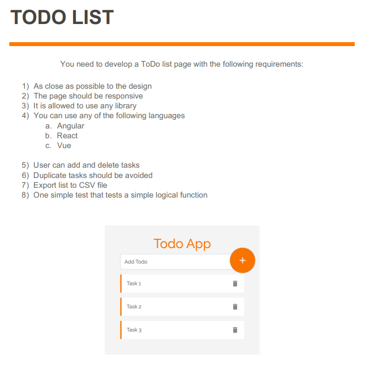
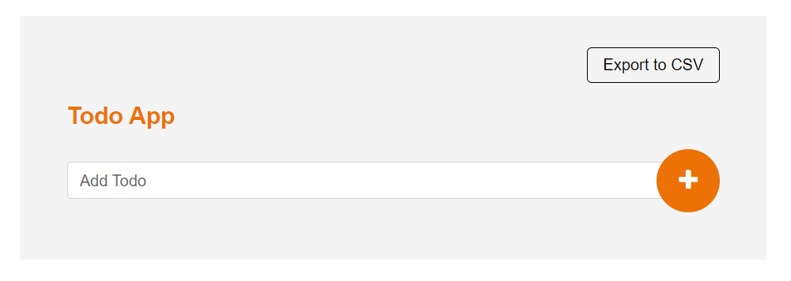
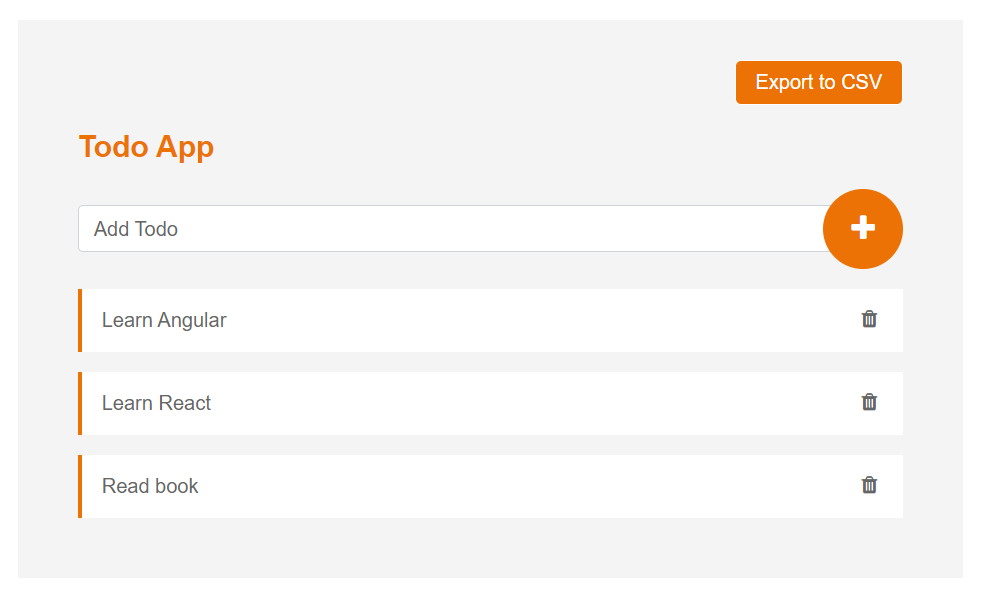

# Out of scope (Nice to have for real world application)
- CSS framework can be utilized for full responsive app 
(Current todo app does not have many elements on page, so it works out of the box)
- Unit test case coverage can be improved with some more time

# TODO App requirements
1) As close as possible to the design
2) The page should be responsive
3) It is allowed to use any library
4) You can use any of the following languages 
   - Angular
   - React
   - Vue
5) User can add and delete tasks
6) Duplicate tasks should be avoided
7) Export list to CSV file
8) One simple test that tests a simple logical function

# Completed Todo App looks like below
   - Initial state
    
    

# AngularTodoApp

This project was generated with [Angular CLI](https://github.com/angular/angular-cli) version 12.2.9.

## Development server

Run `ng serve` for a dev server. Navigate to `http://localhost:4200/`. The app will automatically reload if you change any of the source files.

## Code scaffolding

Run `ng generate component component-name` to generate a new component. You can also use `ng generate directive|pipe|service|class|guard|interface|enum|module`.

## Build

Run `ng build` to build the project. The build artifacts will be stored in the `dist/` directory.

## Running unit tests

Run `ng test` to execute the unit tests via [Karma](https://karma-runner.github.io).

## Running end-to-end tests

Run `ng e2e` to execute the end-to-end tests via a platform of your choice. To use this command, you need to first add a package that implements end-to-end testing capabilities.

## Further help

To get more help on the Angular CLI use `ng help` or go check out the [Angular CLI Overview and Command Reference](https://angular.io/cli) page.
